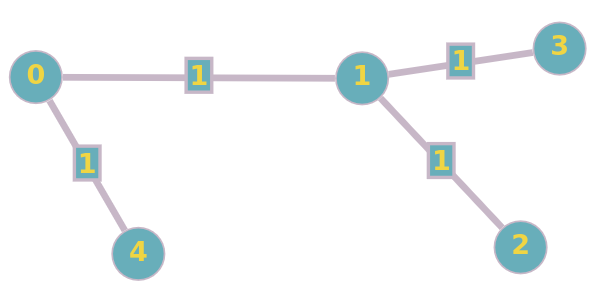

<h1 align="center">Тестоввое задание С++. Cтажировка VK Maps.</h1>

<div align="center">

[]()

</div>

---

<h3 align="center"> 
В данном репозитори представленно решение тестового задания на стажировку в VK Maps на С++.
</h3>

## Оглавление

- [Условие задания](#task_condition)
- [О программе](#about)
- [Запуск](#getting_started)
- [Использованные библиотеки](#built_using)
- [Автор](#authors)

## Условие задания <a name = "task_condition"></a>
Задача сосотоит в следующем. Необходимо написать программу на С++, которая будет считать кратчайшее расстояние от переданной вершины до всех остальных вершин в ненаправленном графе. Расстояние до каждой вершины от переданной необходимо вывести на экран.

Структура графа считывается из файла graph.txt и имеет следующий вид:
```
5   # количество вершин графа
4   # количество ребер графа
0 1 # далее идут ребра графа ("0 1" означает, что есть путь от вершины 0 до 1)
0 4 
1 2 
1 3 
4   # номер вершины от которой необходимо посчитать расстояние до всех остальных
```
Длина каждого ребра равна 1, нумерация вершин начинается с 0, а также допускается, что существует путь до каждой вершины от каждой.
Соответсвенно вышеприведенный ввод даст нам следующий граф:



Вывод программы будет следующий:
```
1 # расстояние от вершины 4 до вершины 0
2 # расстояние от вершины 4 до вершины 1
3 # расстояние от вершины 4 до вершины 2
3 # расстояние от вершины 4 до вершины 3
0 # расстояние от вершины 4 до вершины 4
```
## О программе <a name = "about"></a>

Программа предоставляет возможность пользователю по входным данным найти кратчайшее расстояние от заданной вершины до всех остальных. Для нахождения такого расстояния используется алгоритм поиска в ширину. Его выбор обусловлен тем, что все ребра имеют одинаковый вес, равный единице. Если бы это было не так, то пришлось бы применять более сложные алгоритмы, такие как алгоритм Дейкстры (граф без циклов и ребер с отрицательным весом) или фалгоритм Беллмана-Форда (вес ребер может быть отрицательным).

В программе учтенна валидация данных, таким образом если формат данных в файле будет некорректным, программа сообщит об этом пользователю.

Также написанны тесты, учитывающие ключевые случаи входных данных, такие как: пустой файл, одна вершина, граф с циклами и так далее. Для их написанния была использована стороняя библиотека [Catch2](https://github.com/catchorg/Catch2/tree/v2.x).


## Запуск <a name = "getting_started"></a>
Чтобы скомпилировать программу необходимо выполнить команду
```
make
```
После этого в корне проекта появится файл **main**. После его запуска программа выведет результат в **stdout**.

Для запуска тестов необходимо выполнить команду
```
make check
```
Она запустит заранее прописанные тесты и выведет результат их выполнения.

Для удаления всех ранее созданных объектных файлов необходимо выполнить команду
```
make clean
```

## Использованные библиотеки <a name = "built_using"></a>

- [Catch2](https://github.com/catchorg/Catch2/tree/v2.x) - Тестирование

## Автор <a name = "authors"></a>

- [@Kirill752](https://github.com/Kirill752)